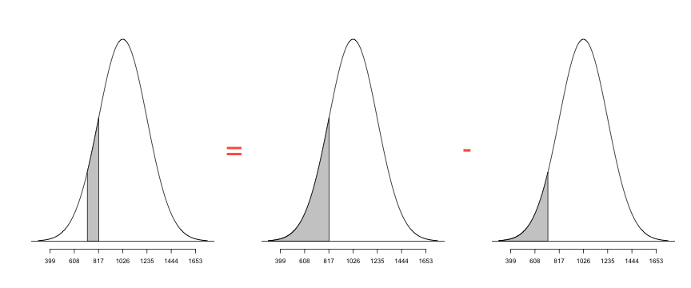

## Curve of Forgetting


--- &text2

## Multi Text

Find the following areas under the standard normal curve, in percents. Please don't enter the percent sign.

*** ans:57.63

A. between -1.2 and 0.5

*** ans:`r pnorm(0.4, lower.tail = F)`

B. to the right of 0.4

*** =explanation

Answer

--- .segue .dark .nobackground

## Learn By Doing

--- &tabs

## TabRow

*** #home

## Home

home

*** #profile

## Profile

profile


---

## One Categorical Variable

The same survey that asked 1,200 U.S. college students about their body perception also asked the following question:

"With whom do you find it easiest to make friends?" (opposite sex, same sex or no difference).

In this activity we will use the collected data to:

- learn how to tally our data into a table of counts and percents.
- learn how to produce a pie chart.

--- 

## Distribution

Let us start by creating a frequency table of the data. We will use the `tally` function in the `mosaic` package to achieve this.

```
x       variable name
data    dataset name
format  count, proportion or percent
margins should marginal distributions be displayed?
```

```{r eval = F, echo = F}
require(mosaic)
tally(~ easiest, data = Friends)
tally(~ easiest, data = Friends, margins = F)
tally(~ easiest, data = Friends, format = 'percent')
```


--- &radio

## Ex 1.86 SAT vs. ACT

Eleanor scores 680 on the Mathematics part of the SAT. The distribution of SAT scores in a reference population is Normal, with mean 500 and standard deviation 100. Gerald takes the American College Testing (ACT) Mathematics test and scores 27. ACT scores are Normally distributed with mean 18 and standard deviation 6. Assuming that both tests measure the same kind of ability, who did better?

1. _Eleanor_
2. Gerald

*** .explanation

The best way to compare their performance is to calculate their standardized scores.

$$z_E = \frac{680 - 500}{100} = `r (680 - 500)/100`$$
$$z_G = \frac{27 - 18}{6} = `r (27 - 18)/6`$$

Since, Eleanor has a higher standardized score, we can conclude that Eleanor did better!

---

## Facebook Friends

The number of facebook friends a person has is normally distributed with mean 190 and standard deviation 36. Answer the next three questions based on this.

---  &text ans:280

## Ex 1

The number of facebook friends a person has is normally distributed with mean 190 and standard deviation 36. If the number of friends Chris has is 2.5 standard deviations above the mean, how many friends does he have?

<div class='source'>
 <a href="http://www.youtu.be/cRb2ONJAvog">
   http://www.youtu.be/cRb2ONJAvog
 </a>
</div>

*** .explanation

<style>
.modal-body iframe {
  height: 350px;
}
</style>

---  &text ans:5

## Ex 2

Approximately _____ % of people have more than 262 facebook friends.


<div class='source'>
 <a href="http://www.youtu.be/c6PzC3WZD4I">
   http://www.youtu.be/c6PzC3WZD4I
 </a>
</div>


*** .hint

Think in terms of how many standard deviations away 262 is from 190.

---  &text ans:16

## Ex 3

Approximately _____ % of people have less than 154 facebook friends.

<div class='source'>
 <a href="http://www.youtu.be/19ZQP5wzmKA">
   http://www.youtu.be/19ZQP5wzmKA
 </a>
</div>

---

## Background

Sandra Guerra Thompson, a Professor of Law and Criminal Justice and Institute Director at the University of Houston Law Center, wrote Beyond a Reasonable Doubt? Reconsidering Uncorroborated Eyewitness Identification Testimony, in 2008 in the U. C. Davis Law Review.

This article reviews the overwhelming scientific evidence that establishes that eyewitnesses are notoriously inaccurate in identifying strangers, especially under the conditions that exist in many serious offenses such as robbery. Many of the factors that tend to decrease the accuracy of an identification are intrinsic to a witness’ abilities, and not the product of inappropriate suggestion by the police.

We know, for example, that eyewitnesses identify a known wrong person (a “filler” or “foil”) in approximately 20% of all real criminal lineups.

Using the data that 20% of eyewitnesses identify a known wrong person, we wish to create a probability distribution and answer some probability questions.

<div class='source'>
 Source: CMU Open Learning
</div>

---

```{r eval = F}
# Let's look at the shape of the full model surface. 
# expand.grid makes it easy to generate an evenly spaced 
# grid of predictors over the entire design space.
grid <- expand.grid(
 class = unique(mpg$class),
 displ = seq(min(mpg$displ), max(mpg$displ), 
 length = 20)
)
grid$consump <- predict(mod1, newdata = grid)
qplot(displ, consump, data = mpg) + 
 geom_line(data = grid, colour = "grey50") + 
 facet_wrap(~ class)
qplot(displ, resid, data = mpg) + facet_wrap(~ class)
```

--- &submitcompare1

## Polling Report

<span class='definition'>Did I Get?</span>

According to pollingreport.com, a poll conducted by FOX News estimated that on the issue of abortion, roughly 44% of registered voters in the United States are pro-choice, and roughly 47% are pro-life (the remaining 9% are undecided). What is the probability that two simultaneously and randomly chosen registered voters are pro-life?

*** =answer

Let L1 be the event that person 1 is pro-life, and let L2 be the event that person 2 is pro-life. We need to find P(L1 and L2). Since the two were chosen at random, L1 and L2 are independent and we may use the Multiplication Rule for Independent Events

$$
\begin{aligned}
P(L1 \cap L2) & = P(L1) \times P(L2) \\ 
              & = 0.47 \times 0.47 \\
              & = `r 0.47*0.47`
\end{aligned}
$$

--- &checkbox

## Linda

Linda is 31 years old, single, outspoken, and very bright. She majored in philosophy. As a student, she was deeply concerned with issues of discrimination and social justice, and also participated in anti-nuclear demonstrations.

Which is more probable?

1. _Linda is a bank teller._
2. Linda is a bank teller and is active in the feminist movement.

*** .explanation

If you chose (2), stop back and think. Suppose we denote the event of Linda being a teller by A and the event she is active in the feminist movement by B, then probabilities in question can be written as.

- P(A)
- $P(A \cap B)$

This is called the [conjugacy fallacy](http://en.wikipedia.org/wiki/Conjunction_fallacy) that occurs when it is assumed that specific conditions are more probable than a single general one.

---  &radio2

## Correlation

Which of these two scatterplots have a higher correlation?

1. A
2. B

*** =image


*** .explanation

Both have the same correlation.

---  &radio

## Smoke Alarms

```{r echo = F}
pa = 0.50; pb = 0.40
ansA = pa + pb
ansB = pa * pb
ansC = pa + pb - pa*pb
ansD = pa + pb - 2*pa*pb
```

A homeowner has two smoke detector alarms installed, one in the dining room (adjacent to the kitchen) and one in an upstairs bedroom (above the kitchen). If cooking produces smoke in the kitchen, the probability of setting off the dining room alarm (D) is `r pa`. The probability of setting off the bedroom alarm (B) is `r pb`. The two alarms detect smoke independently of each other. If there is smoke in the kitchen, what is the probability that the smoke will be detected and will set off an alarm?

1. `r ansA`
2. `r ansB`
3. _`r ansC`_
4. `r ansD`

*** .explanation

## Solution

Let's first understand what the probability is that we need to find: The smoke from the fire is detected if it sets off the dining room alarm (D) or the bedroom alarm (B) or both, and therefore P(smoke is detected) = P(D or B), which is the probability we need to find.

To that end, we are given a few pieces of information. Let's summarize them:

- P(D) = 0.95
- P(B) = 0.40

Hence, we can use the general addition rule and write

P(D or B) = P(D) + P(B) - P(D)*P(B)

--- &submitcompare1

## Question 1

What is the sample space for this experiment?

*** =answer

The sample space for this experiment is

{HH, HT, TH, HH}

--- &opencpusmall sno:7

## Question 2

```{r echo = F}
getMooreData <- function(dataset){
  base_url = '~/Downloads/data'
  read.delim(file.path(base_url, 'moore', dataset), header = TRUE)
}
```

We can create a scatterplot using the `xyplot` function in the `lattice` package. Click the <i icon-run></i> button to run the code.


```{r eval = F, knitCode = TRUE}
require(lattice)
xyplot(mpg ~ wt, data = mtcars, pch = 16)
```

<p class='build'>
From the scatterplot, we observe a strong, negative, linear relationship between the variables.
</p>


---

## Question 3

A researcher wished to compare the average daily hotel room rates between San Francisco and Los Angeles. The researcher obtained an SRS of 27 hotels in downtown San Francisco and found the sample mean to be \\$156, and a standard deviation of \\$18. The researcher also obtained an independent SRS of 24 hotels in downtown Los Angeles and found the sample mean to be \\$143, with a standard deviation of \\$10.

---

## Binomial Coefficient

<div class='well'>
<p>The number of ways of arranging k successes among n observations is given by the binomial coefficient $${n \choose k} = \frac{n!}{(n - k)!}$$</p>
</div>

You can use the `factorial` function in R to compute this coefficient using the formula. An easier way to achieve the same is to directly use the `choose` function.

```{r}
choose(5, 3)
factorial(5)/(factorial(3)*factorial(2))
```

<div class='alert alert-error'>
<p><b>Ex:</b> Use the <code>choose</code> function to compute $6 \choose 3$</p>
</div>

--- 

## Normal Approximation to Binomial 

Suppose $X \sim Bin(n, p)$ follows a binomial distribution with `n` trials and success probability `p`. For large values of `n`, we can approximate the distribution of $X$ using a normal distribution.

$$X \sim N(\mu = np, \sigma = \sqrt{np(1-p)})$$

<div class='alert alert-success'><p>
<b>Tip</b>: This is especially useful while calculating cumulative probabilities such as $P(X \le x)$, since you can use the standard normal table instead of summing up the binomial probabilities over values 0 through x.
</p></div>

---

## Problem

You ask an SRS of 200 adults if they are concerned about nutrition when eating away from home. Let $X$ represent the total count of people responding "Yes". If the national proportion $p = 0.4$ holds in your area, what is the probability that $X$ lies between 75 and 85?

---

## Solution

We can approximate the distribution of $X$ using a normal distribution with mean $\mu = np$ and standard deviation $\sigma = np(1-p)$.

We can do all the computations using R, as shown below.

```{r}
n = 200; p = 0.4
mu = n * p
sigma = sqrt(n * p * (1 - p))
pnorm(85, mu, sigma) - pnorm(75, mu, sigma)
```

You can visualize the probabilities [here](http://www.statdistributions.com/normal?z=85&mean=80&sd=6.928&tail=3)

---

## Binomial Setting

To identify, if a setting fits the binomial distribution, you need to verify four things.

1. Does every trial have two outcomes?
2. Do we have a fixed number of trials?
3. Are the trials independent?
4. Is the probability of success constant across all trials?


---

## State Hypotheses

Let $\mu_{LA}$ and $\mu_{SF}$ represent the average daily hotel room rates for the two cities. The null hypothesis is that there is no difference between the average rates for these two cities, while the alternate hypothesis is that there is a difference. Accordingly,

$$
\begin{aligned}
H_0: \mu_{LA} - \mu_{SF} & = 0 \\
H_a: \mu_{LA} - \mu_{SF} & \neq 0 \\
\end{aligned}
$$

--- &vcenter

## The 68 - 95 - 99.7 Rule


</img>

*** =pnotes

This rule states that approximately 68% / 95% / 99% of the observations from a normal distribution will fall within one / two / three standard deviations of the mean. 

--- &multitext

## Check

1. Question 1
2. Question 2
3. Question 3

--- &multitext

## Ex 1.83 Young Mens Heights

<span class='example'>Example</span>

The distribution of heights of young men is approximately Normal with mean 69 and standard deviation 2.5 inches. Use the 68 - 95 - 99.7 rule to determine the following.

1. What percent of these men are taller than 74 inches?
2. Between what heights do the middle 95% of young men fall?
3. What percent of young men are shorter than 66.5 inches?

*** .explanation

__Solution__


</img>

1. 74 is 2 sd's away from 69. Hence, 2.5% of young men are taller than 74.
2. Roughly 95% of young men should have heights between $69 \pm 2 \times 2.5$
3. 66.5 is one sd to the left of the mean. Hence, 16% of the young men are shorter than 66.5 inches.

--- 

## Ex 1.34 NCAA Partial Qualifiers

The NCAA considers a student a "partial qualifier" eligible to practice and receive an athletic scholarship, but not compete, if the combined SAT score is at least 720. What proportion of all students who take the SAT would be partial qualifiers?

```{r ncaa, message = F, echo = F, fig.width = 12, fig.height = 5, out.extra='class=center', eval = F}
require(openintro)
par(mfrow = c(1, 3))
normTail(1026, 209, M = c(720, 820))
normTail(1026, 209, L = 820)
normTail(1026, 209, L = 720)
```



*** =pnotes

__Solution__

We need to calculate the proportion of SAT scores falling between 720 and 820. 

--- &multitext

## Ex 1.114 Length of Pregnancies

The length of human pregnancies from conception to birth varies according to a distribution that is approximately Normal with mean 266 days and standard deviation 16 days.

1. What percent of pregnancies last fewer than 240 days?
2. What percent of pregnancies last between 240 and 270 days?
3. How long do the longest 25% pregnancies last?

*** .explanation

1. <span class='answer'>`r pnorm(240, 266, 16)*100`</span>
2. <span class='answer'>`r (pnorm(270, 266, 16) - pnorm(240, 266, 16))*100`</span>
3. <span class='answer'>`r qnorm(0.25, 266, 16, lower.tail = F)`</span>

--- &multitext

## Normal Distributions

A distribution of test scores is approximately normal with mean 65 and SD 10. Approximate (please don't enter units):

1. The percent of scores between 50 and 70:
2. The 75th percentile of the scores:
3. The interquartile range of the scores

*** .explanation

We can compute the answers using R.

A. The percent of scores between 50 and 70 is given by

```{r}
p70 = pnorm(70, mean = 65, sd = 10) 
p50 = pnorm(50, mean = 65, sd = 10)
p70 - p50
```

B. The 75th percentile of scores is given by

```{r}
qnorm(p = 0.75, mean = 65, sd = 10)
```

C. The interquartile range of the scores can be found to be

```{r}
Q3 = qnorm(0.75, mean = 65, sd = 10)
Q1 = qnorm(0.25, mean = 65, sd = 10)
Q3 - Q1
```


--- #highway

## Highway Signs

A Pennsylvania research rm conducted a study in which 30 drivers (of ages
18 to 82 years old) were sampled, and for each one, the maximum distance (in
feet) at which he/she could read a newly designed sign was determined. The
goal of this study was to explore the relationship between a driver's age and the
maximum distance at which signs were legible, and then use the study's findings
to improve safety for older drivers.

```{r results = 'asis', message = F, echo = F}
require(xtable); require(MindOnStats)
data(SignDist)
options(xtable.type = 'html', xtable.include.rownames = F)
xtable(head(SignDist))
```

<style>
#highway table {
  width: 50%;
  margin: auto auto;
}
</style>

--- &submitcompare2 rows:5

## OkCupid

The solid curve represents the distribution of heights of all males in the US. The dotted curve represents the distribution of heights reported by males on OkCupid, an online dating website.


*** =question

What is happening here?

*** =answer

It is easier to interpret things if we overlay a fitted normal distribution for the heights reported by males on OkCupid. Looking at the graph carefully, we can observe two things.


1. Males on OkCupid probably tend to inflate their heights!
2. You can also see a more subtle vanity at work: starting at roughly 5' 8", the top of the dotted curve tilts even further rightward. This means that guys as they get closer to six feet round up a bit more than usual, stretching for that coveted psychological benchmark.

--- &submitcompare2 rows:6

## Distance vs. Age

```{r echo = F, dev = 'svg'}
require(ggplot2)
qplot(Age, Distance, data = SignDist)
```

*** =question

Describe the relationship!

*** =answer

__Direction__ : The direction of the relationship is `negative`, which makes sense in context, since as you get older your eyesight weakens, and in particular older drivers tend to be able to read signs only at lesser distances. A line drawn over the scatterplot illustrates the negative direction of this relationship.

__Form__ : The form of the relationship seems to be `linear`. Notice how the points tend to be scattered about the line. 

__Strength__: Although, as we mentioned earlier, it is problematic to assess the strength without a numerical measure, the relationship appears to be moderately strong, as the data is fairly tightly scattered about the line.

__Deviations__: Finally, all the data points seem to "obey" the pattern, there do not appear
to be any outliers.

---

## Form

The form of the relationship is its general shape. When identifying the form, we try to find the simplest way to describe the shape of the scatterplot. There are many possible forms. Here are a couple that are quite common:

<div class='build center'>
  
  
  
</div>

---

## Question 6.2

The medical director of a large company is concerned about the effects of stress on the company’s younger executives. According to the National Center for Health Statistics, the mean systolic blood pressure for males 35 to 44 years of age is 128 and the standard deviation in this population is 15. The medical director examines the records of 72 executives in this age group and finds that their mean systolic blood pressure is 129.93. Is this evidence that the mean blood pressure for all the company’s young male executives is higher than the national average? Use $\alpha = 0.05$.

__Given__

> - $\bar{x} = 129.93$
> - $\sigma = 15$
> - $n = 72$
> - $\mu_0 = 128$

---

## Step 1. State Hypothesis

The medical director is interested in evidence that supports his hypothesis that the mean blood pressure for the company's male executives is higher than the national average (which is 128). Hence, this would be the alternate hypothesis.

$$\begin{aligned}
H_0: \mu & = 128 \\
H_a: \mu & > 128 \\
\end{aligned}$$

<div class='alert alert-success'><p>
<b>Tip: </b> Always start by writing the alternate hypothesis first. Remember that the way hypothesis testing is set up, the statement you want to support should be cast as the alternate hypothesis. The NULL hypothesis can NEVER be proved!
</p></div>

--- #mytable

<style>
#mytable table {
  width: 60%;
  margin: auto auto;
}
#mytable td,
#mytable th{
 font-size: 1.2em;
 line-height: 1.6em;
}
</style>

## Step 2. Identify Test Statistic

We are testing a hypothesis about a single mean. Moreover, we DONT know the standard deviation of the population. Hence, we use a __1-sample t-test__ with $T \sim t(df = n - 1)$.

Description | Formula              | Value 
------------|----------------------|--------
Parameter   | $\mu$                | 
Statistic   | $\bar{x}$            |
Std.Error   | $\frac{s}{\sqrt{n}}$ |


---

## Boxplots

Below is a boxplot of yearly income by marital status for individuals in the United States.

```{r box1, echo = F, fig.width = 6, fig.height = 6, out.extra = 'class=center'}
library(ElemStatLearn)
data(marketing)
boxplot(marketing$Income ~ marketing$Marital,
    col="grey",xaxt="n",ylab="Income",xlab="")
axis(side=1,at=1:5, labels=c("Married","Living together/not married",
  "Divorced or separated","Widowed","Nevermarried"),las=2)
```

Click `p` to see the R code used to create the plot.

*** =pnotes

```{r box1, eval = F, echo = TRUE, tidy = FALSE}
```


---  &checkbox .small

Which of the following can you conclude from the plot? (Check all that apply)

1. _The 25th percentile of the income for married individuals is almost the same as the median for individuals living together but not married._
2. The medians for all individuals who are not currently married are almost the same.
3. There are more individuals who are widowed than divorced in this data set.
4. There are more individuals who were never married than divorced in this data set.


---

## Learning Environments

1. Slides
2. Screencasts
3. Slidecasts
4. Integrated

*** =spnotes

This is a prototype of an integrated learning environment to enhance learning experience both online and offline. It is still work-in-process and the idea of putting this together is to share what has been done and seek feedback on how it can be improved to evolve into a tool that is useful for everyone.

--- &opencpu4 sno:0

## Slides

```{r eval = F, knitCode = TRUE}
# install ggplot2 if you have not done it already
# install.packages('ggplot2')
library(ggplot2)
qplot(wt, mpg, data = mtcars)
```


*** =pnotes

The first environment we will consider is the ubiqutous slide deck, without which no class, online or offline is considered complete. Slide decks serve dual roles, first as a synchronous teaching aid in class that helps anchor a lecture, and second as an asynchronous record of what was taught, allowing students to revisit the contents later. 

Here is how an introductory slide on a `ggplot2` tutorial might look like. It shows the user how to install ggplot2 and construct a simple scatterplot, along with the output produced.  

Now, this would work great in a classroom environment with an instructor lecturing along. However as a standalone, it falls short. This concern can be partly alleviated by adding more prose to the slide itself or sharing the extra material as speaker notes. However, it is still not efficient.

A second issue with this approach is that to follow along, a student would need to copy the code from the slide, paste it into their code editor, run the code to see the results and then return back to the slide deck. I believe a lot of back and forth between slides and a code editor is highly distracting to the learning process. 

--- .fill

## Screencasts

<iframe width="960" height="720" 
  src="http://www.youtube.com/embed/TagaAeIHKks" frameborder="0" allowfullscreen>
</iframe>

*** =pnotes

The second environment we will look at is the use of screencasts, which have become increasingly popular


A screencast allows an instructor to record a full demo of the lesson, thereby providing students with a more personalized learning experience. However, a serious shortcoming with screencasts is that students cannot click through links or copy-paste code from the video. So they must be supplemented with slides or a file containing all the code.

---

## Slidecasts

*** =pnotes

The next environment we will review is audio/video synced with slides. In fact, if you have not realized it already, this presentation so far has been an audio synced slideshow. If you are not convinced, try copying some text from the screen.

Audio/Video synced slideshows are a great step forward towards the ideal learning environment. They combine the advantages of slides and screecasts. Several popular services like [Slideshare](http://www.slideshare.com) already allow users to create synced presentations.

So what is the problem. Well, these presentations are still static. What if you want to embed interactive content that a student can explore?

--- .segue .dark .nobackground

## Integrated Learning Environment
 

*** =pnotes

Now, I will get into what an integrated learning environment can provide.

--- &opencpusmall sno:1

## Execute Code

Let us start by creating a simple scatterplot. We use the `qplot` (quick plot) function and pass it the x and y variables along with the data.

```{r eval = F, knitCode = TRUE}
require(ggplot2)
qplot(x = wt, y = mpg, data = mtcars)

## your turn

```

*** =hint

This is a hint

```r
qplot(wt, mpg, data = mtcars)
```


*** =task

Modify the code to create a scatterplot of `disp` vs `hp`.

---  &radio

## Answer Quiz

Consider the assignment `x <- c('alpha', TRUE, 1)`. What would be the `class` of `x`?

1. _character_
2. numeric
3. logical
4. mixed

*** .hint

A vector is a collection of items of the same type!

*** .explanation

A vector is a collection of items of the same type. Since, `x` consists of items of different types, R does what is called *type coercion* and converts everything to a character.

--- 

## Stemplots

```{r echo = TRUE, comment = NA}
x <- rnorm(100)
stem(x)
```

*** =ppnotes

<div style="background:#fff; padding:3px">
  <iframe style="border:1px solid gray; height:500px; width:500px"
    src="http://piratepad.net/yourpadname?fullScreen=1">
  </iframe>
<div>

---

## Percentile

The nth percentile of an observation variable is the value that cuts off the first n percent of the data values when it is sorted in ascending order.

__Example__

Find the 32nd, 57th and 98th percentiles of the eruption durations in the data set `faithful`.

__Solution__

We use the `quantile` function to compute the percentiles of eruptions with the desired percentage ratios.

```{r prompt = TRUE}
quantile(faithful$eruptions, c(0.32, 0.57, 0.98))
```

--- bg:lightblue &opencpusmall sno:2

## Exercise

Find the 17th, 43rd, 67th and 85th percentiles of the eruption waiting periods in faithful.

<div><textarea class='knitCode'></textarea></div>

*** =hint

```{r}
quantile(faithful$waiting, c(0.17, 0.43, 0.67, 0.85))
```

---

## Interquartile Range

The interquartile range of an observation variable is the difference of its upper and lower quartiles. It is a measure of how far apart the middle portion of data spreads in value.


<div class='source'>
Source: <a href=http://sph.bu.edu/otlt/MPH-Modules/BS/BS704_SummarizingData/BS704_SummarizingData7.html>Boston University</a>
</div>

---

## Interquartile Range

We can use the `IQR` function to compute the interquartile range of a variable `x`.

```{r prompt = TRUE}
x <- c(62, 63, 64, 70, 72, 76, 77, 81, 81)
IQR(x)
```

--- bg:lightgreen sno:3 &opencpusmall

## Exercise

Find the interquartile range of eruption waiting periods in faithful.

<div><textarea class='knitCode'></textarea></div>

*** =hint

## Solution

```{r}
IQR(faithful$waiting)
```

---

## Histogram

```{r hist1, echo = F, out.extra = 'class="center"', dpi = 100, fig.height = 5}
require(lattice)
histogram(~ mpg, data = mtcars)
```

*** =pnotes

A `histogram` consists of vertical bars that graphically shows the frequency distribution of a quantitative variable. The area of each bar is equal to the frequency of items found in each class. You can draw a histogram using the `histogram` function in the `lattice` package.

```{r hist1, echo = TRUE, eval = F}
```


--- &opencpusmall sno:4

## Histograms

The `histogram` function accepts two other arguments `breaks` and `color` which allow you to customize the graph. Experiment with the two arguments.

```{r eval = F, knitCode = TRUE}
require(lattice)
# fill the color of your choice
mycolor =         
histogram(~ mpg, data = mtcars, col = mycolor)
```

--- &vcenter

## Boxplot


---

## Boxplot

It is easy to draw a boxplot in R using the `bwplot` function in the `lattice` package. Let us draw a boxplot of the variable `mpg` in the data set `mtcars`.

```{r fig.height = 5, figh.width = 8, out.extra = 'class=center'}
bwplot(~ mpg, data = mtcars)
```

--- &opencpusmall sno:5

Construct a boxplot of `wt` from the dataset `mtcars`. What can you conclude about the distribution of weights based on the plot?

```{r knitCode = TRUE, eval = F}
## enter your code
require(lattice)
```

*** =hint

The reason my plots were prettier, is because I used another R package `latticeExtra` that allows customizing plots to appear like those in the economist. If you want your plots to appear like mine, add the following lines to your R code.

```{r eval = F, tidy = FALSE}
# load latticeExtra 
require(latticeExtra)
# set theme and options according to the Economist
trellis.par.set(theme = theEconomist.theme(
  with.bg = TRUE, box = 'transparent')
)
lattice.options(theEconomist.opts())
```

---

## Draggable

<script src="http://code.jquery.com/ui/1.10.1/jquery-ui.js"></script>
<link rel="stylesheet" href="http://code.jquery.com/ui/1.10.1/themes/base/jquery-ui.css" />

<style>
#draggable { width: 150px; height: 150px; padding: 0.5em; }
#draggable {
position: relative;
left: 158px;
top: 55px;
}
</style>
<script>
  $(function() {
    $("#draggable").draggable()
  .click(function() {
    $(this).draggable({ disabled: false });
}).dblclick(function() {
    $(this).draggable({ disabled: true });
});
  });
</script>

 
<div id="draggable" class="ui-widget-content">
  <p contenteditable="true">Drag me around</p>
</div>

--- #genmult

<style>
#genmult {
  font-size: 3em;
  color: "darkbrown";
}
</style>

## General Multiplication Rule

<div class='vcenter'>
$$P(A \cap B) = P(A) \times P(B \mid A) $$
</div>

*** =pnotes

The general multiplication rule extends the multiplication rule for the joint probability of two independent events. It states that the probability that events A and B both happen is the probability that one of them happens, P(A) multiplied by the probability that the other event happens, conditional on the first one happening, i.e. P(B | A). This rule follows directly from the definition of conditional probability, which states that P(A | B) = P(A and B)/P(B).

This rule can be used in two different ways.  

1. It can be used to compute the probability of two events happening together.
2. It can be used to verify that two events are independent. Note that if two events are independent, then P(A and B) = P(A) x P(B). Comparing this equation with the general multiplication rule, we get that P(A | B) = P(A). This equation is often used to verify if two events are independent.

---  &checkbox

## Question

If two events A and B are independent, which of the following are TRUE?

1. P(A | B) = P(A and B)
2. _P(A | B) = P(A)_
3. P(A | B) = P(B)
4. P(A | B) = 0
5. _P(A and B) = P(A) x P(B)_

--- .segue .nobackground .dark

## Finding Help

---

## RSeek

<iframe src=http://www.rseek.org/></iframe>

---

## Split-Apply-Combine


</img>


*** =pnotes

Split-Apply-Combine is a very useful design pattern that abstracts many common exploratory analyses. Let me illustrate it with a simple example. Suppose we have a data set with two columns `x` and `y`. We are interested in creating a summary of this data set by calculating the mean value of `y` by `x`. Here is one way to go about such a problem.

1. Split the data frame by values of `x`.
2. Apply mean calculations for each piece.
3. Combine the pieces together into a data frame.

--- &opencpusmall sno:6 bg:lightblue

In this exercise, we will use a toy example to get used to using R as a calculator and writing functions. It's your birthday and you and five friends have gone for a meal at Pizza Express. You have had a full three course meal including the following items:

```{r knitCode=TRUE, eval = FALSE}
# enter your code here
```

--- .segue .dark .nobackground

## Exercise

--- .fill .nobackground

<iframe src=http://rstudio-pubs-static.s3.amazonaws.com/1496_2d40899c7504475da7ffc178910e91d4.html></iframe>

--- &popcorn

<section class="video" id="video">
  <div id="player" style="width: 160px; height: 120px"></div>
</section>


